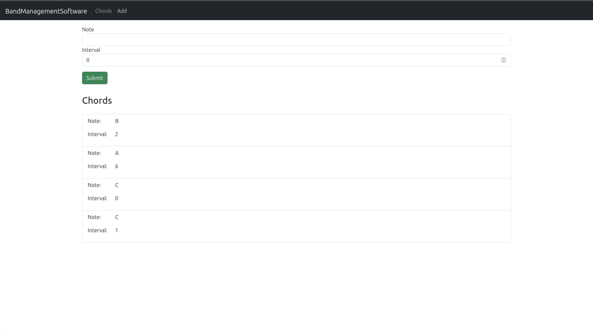
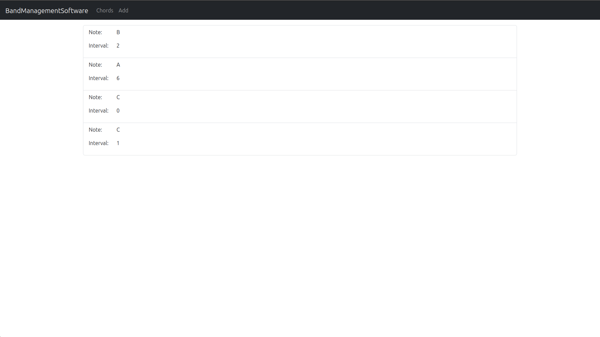
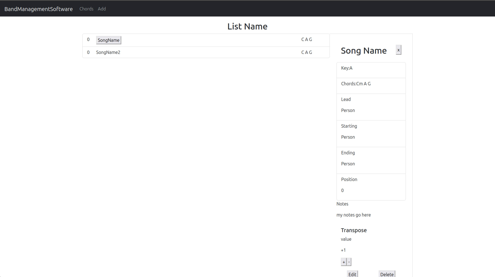

# Band Management Software (BMS)

The goal of this web application is to provide a simpler, better way of 
managing song lists and set lists for the various bands that I'm in.
I'm not sure if the way we do things is applicable to anyone else but since
I'm part of many different groups and the best option we have is
spreadsheets which get increasingly hard to manage, I'm hoping that this
at the very least makes my life easier and speeds up practices.

## Features

By the end of the project I should be able to:
1. restrict users' view based on their band.
2. Create master lists and sublists on a per gig basis
3. reduce redundancy in the master list by utilizing mathematics to transpose keys for each song so that we can quickly adapt to different singers
4. Create an extensible, responsive, accessible interface for all users
5. Meet the needs of each group and improve productivity at practices by offering relevant fields listed below.

## Planned Data Points

- Key
- Chords
- Notes
- Lyrics
- Link to song
- Drum patch
- Lead Keyboard Patch
- Lead Guitar Patch
- Rhythm Guitar Patch
- Rhythm Keyboard Patch
- Singers
- Starting
- Ending
- BPM
- Song Name

## Stages of Development

- Planning (Mostly complete but no wireframes. YOLOing it.)
    - Planned models
    - Planned desired feature set
    - Planned MVP
- Building MVP (Currently in progress)
- Deployment
- Updates, Support, and Improvement/Feature Extension

## Currently working on...

- Building front end interface for desktop and mobile
- Creating backend models, controllers, and services
- Implementing authentication so I can get started on ACLs

## Defining MVP

- Ability to add songs
- user restricted access
- Ability to reorder songs
- Ability to add chords and key
- Ability to add notes
- Ability to transpose
- Ability to reorder songs
- Ability to print lists and export PDF/excel sheet

## Technologies and Libraries

Using the PERN Stack (PostGreSQL, ExpressJS, ReactJS, NodeJS)
Planning on using Passport for authentication
Using Bootstrap for Frontend Styling

## Current State of Project images

